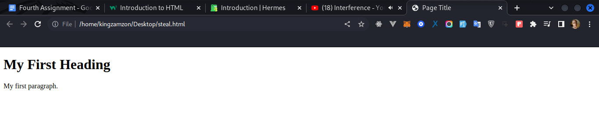

# Installation

Web development have been built on 3 languages so far: HTML, CSS and JavaScript.

## Getting Started

Get started by **creating a new project on your laptop**.

Or **try CodePen** with **[codepen.io](https://codepen.io/kingzamzon/pen/ExeNwKz)**.

### What you'll need this

- [Google Chrome](https://www.google.com/chrome/) Browser:
  - Though you can use any choice browser.
- [Visual Studio Code](https://code.visualstudio.com/) is a code editor:
  - We using visual studio code cause of its make development faster with suggestion and autocompletion.

## Generate a new Project

Generate a new Project in your laptop by creating a folder, run the command:

```bash
mkdir html-tutorial
```

You can type this command into Command Prompt, Powershell, Terminal, or any other integrated terminal of your code editor.

## Start your site

Run the development server:

```bash
cd html-tutorial
```

The `cd` command changes the directory you're working with.

Open `target file` (this page) and edit some lines: the site **won't reloads automatically** and reload the page anytime changes are made.

## Web Browsers

The purpose of a web browser (Chrome, Edge, Firefox, Safari) is to read HTML documents and display them correctly.

A browser does not display the HTML tags, but uses them to determine how to display the document:


